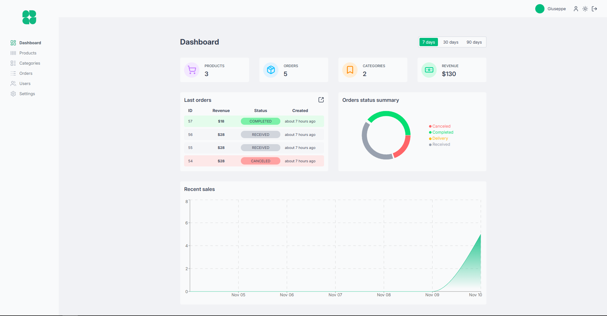
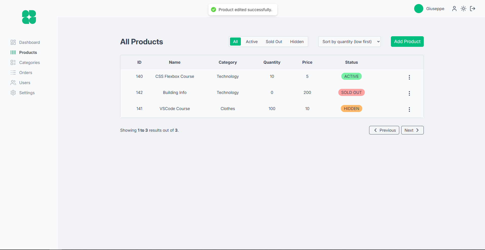
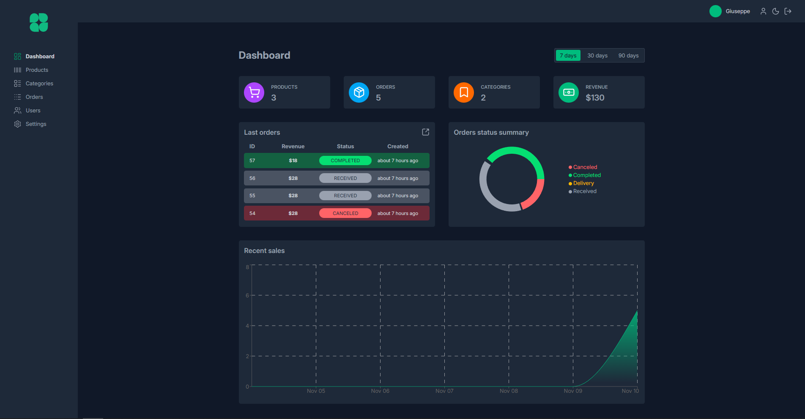
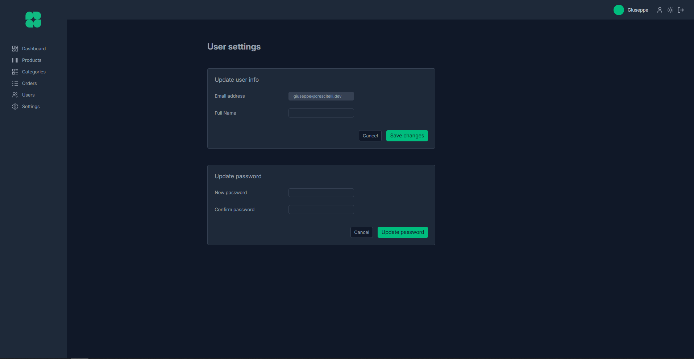

# Shoppy Dashboard

Shoppy Dashboard is a modern and intuitive web application designed for owners of [Shoppy Website](https://github.com/crstelli/shoppy-website) to efficiently manage their business operations. It provides tools to add and edit products, track and fulfill orders, monitor sales performance, and visualize key business metrics through clean, responsive dashboards.






## Tech Stack

- Vite
- React 19.1.1
- TailwindCSS 4.1.14
- Tanstack Query
- React Router
- Supabase
- date-fns
- lucide-react
- react-hook-form
- react-hot-toast
- recharts

## Installation

Clone the repository:

```bash
git clone https://github.com/crstelli/shoppy-dashboard
```

Navigate into project folder:

```bash
cd shoppy-dashboard
```

Install dependencies:

```bash
npm install
```

Start the development server:

```bash
npm run dev
```

Open your browser and navigate to:

```bash
http://localhost:5173
```

## Environment Variables

You need to configure environment variables for the app to work correctly. Create a .env.local file in the project root and add:

```env
VITE_SUPABASE_URL=Your Supabase URL
VITE_SUPABASE_ANON_KEY=Your Supabase Key
```

## Features

- Authentication and new account creations.
- Complete Dashboard with all data about orders and products, filtered by time range.
- Product creation, editing and deleting.
- Sorting by filtering, name and status, filtering by status.
- Pagination.
- Synchronized settings updating.
- User profile settings.
- Dark and light mode.

## Future Improvements

- Order Tracking with notifications.
- Chat with users.
- Automatic order status updating.

## Author

Giuseppe - [LinkedIn](https://linkedin.com/in/giuseppecrescitelli) - [Portfolio](https://crescitelli.dev/)
